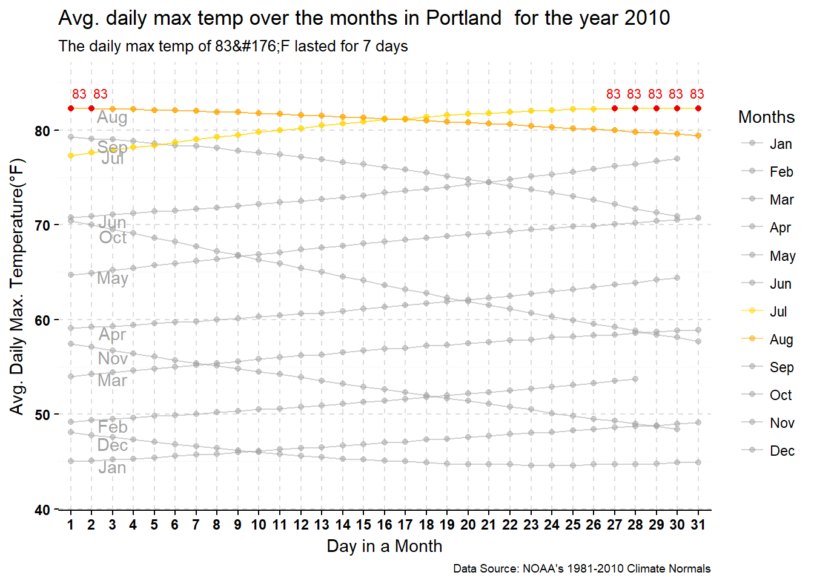

### 1. Relevant R Code


```r
w_2<-read.csv("./data/1374765.csv")

w_2<- w_2 %>% mutate(MDate=as.character(DATE)) %>% 
  filter(STATION=="GHCND:USW00024229") %>% 
  select(MDate,DLY.TMAX.NORMAL) %>% 
  mutate(MDate=ymd(MDate))

w_monthly<- w_2 %>% 
  mutate(FMonth=month((MDate),label = FALSE),
         TotDM=days_in_month(MDate),
         FDay=day(MDate)) 


llabels <- c("1"="Jan","2"="Feb","3"="Mar","4"="Apr","5"="May","6"="Jun","7"="Jul",
           "8"="Aug","9"="Sep","10"="Oct","11"="Nov","12"="Dec")

n1<-c("gray63","gray63","gray63","gray63","gray63","gray63","gold","orange","gray63",
      "gray63","gray63","gray63")
ggplot(w_monthly,aes(x=as.factor(FDay),
                     y=DLY.TMAX.NORMAL,
                    colour=as.factor(FMonth),
                    group=as.factor(FMonth)))+
  geom_line(alpha=0.5) + 
  geom_point(alpha=0.5)+
  geom_point(data=filter(w_monthly,FMonth %in% c(7) ),color="gold",alpha=0.5)+
  geom_line(data=filter(w_monthly,FMonth %in% c(7) ),color="gold",alpha=0.5)+
  geom_point(data=filter(w_monthly,FMonth %in% c(8) ),color="orange",alpha=0.5)+
  geom_line(data=filter(w_monthly,FMonth %in% c(8) ),color="orange",alpha=0.5)+
  geom_point(data=filter(w_monthly,DLY.TMAX.NORMAL==82.3 ),color="red2")+
  geom_text(data = filter(w_monthly,FDay %in% c(3)),
            color = "gray63",
            aes(label =month(MDate,label=TRUE)),
            vjust="top"
            )+
  geom_text(data = filter(w_monthly,DLY.TMAX.NORMAL==82.3 & FDay>20 ),
            color = "red2",
            aes(label = ceiling(DLY.TMAX.NORMAL)),size=2.9,
            vjust=-1,
            hjust=1.3,nudge_x = 0.5
  )+
  geom_text(data = filter(w_monthly,DLY.TMAX.NORMAL==82.3 & FDay<20 ),
            color = "red2",
            aes(label = ceiling(DLY.TMAX.NORMAL)),size=2.9,
            vjust=-1,
            hjust=-0.1
  )+
  
  scale_y_continuous(limits = c(42,85)
                     )+
  theme_minimal() +
  labs(title="Avg. daily max temp over the months in Portland  for the year 2010",
       subtitle="The daily max temp of 83&#176;F lasted for 7 days",
       caption="Data Source: NOAA's 1981-2010 Climate Normals",
       color = "Months", 
       x="Day in a Month",
       y="Avg. Daily Max. Temperature(°F)") +
  scale_colour_manual(values=n1,labels=llabels)+
  theme(
        panel.grid.major = element_line(linetype = 2,color="#dddddd"), 
        panel.grid.minor = element_line(linetype = 3,color="#dddddd"), 
        axis.text = element_text(face="bold",color="black"),
        axis.line.x = element_line(linetype =1,color = "black"),
        axis.ticks.x = element_line(linetype =1,color = "black"),
        axis.ticks.y = element_line(linetype=1,color = "black"),
        plot.caption = element_text(size  ="7")
        )
```



### 2. Description of the Type of Graph

This is a line chart used to show the weather dataset. Since, most time series dataset use a trend line chart, I decided to settle with this.


### 3. Description of the DATA used


```r
glimpse(w_2)
```

```
## Observations: 365
## Variables: 2
## $ MDate           <date> 2010-01-01, 2010-01-02, 2010-01-03, 2010-01-0...
## $ DLY.TMAX.NORMAL <dbl> 45.0, 45.1, 45.2, 45.3, 45.4, 45.6, 45.7, 45.8...
```
The Data consists of nominal/qualitative variables - station and station names and the quantitative variables are `DLY-TAVG-NORMAL`,`DLY-TMAX-NORMAL`,`DLY-TMIN-NORMAL` which are calculated as running averages over the period (1981-2000). Here, the variable name itself suggests the meaning i.e. TAVG-NORMAL means daily average temperature, TMAX-NORMAL means daily max temperature, TMIN-NORMAL means daily min. temperature.


### 4. Description of the _AUDIENCE_

This dataset can be used for weather analyst / general public who wants to 
see the annual weather highlights for Portland in the year 2010. It can also be published in a scientific journal or a newspaper article.


### 5. Representation description

In the above graph, we are trying to see which day was the warmest/hottest in Portland for the year 2010. 


### 6. How to read it & what to look for?

The first point of interaction with the graph is reading the title and then the subtitle. In this way, one can decipher the meaning of the plot. After reading the title, subtitle, we see that the graph is showing the daily avg temperature for each day of the month. It also shows the highlighted maximum temperature for the whole year i.e 83&#176;F and that it lasted for approx. 7 consecutive days.


### 7. Presentation Tips:

I have used qualitative color palette "Paired" from ColorBrewer  for the 12 month trend lines since there are only two available palettes with 12 colors. The x-axis
and the y-axis text,major and minor gridlines are colored for emphasis and effect. The scale for y axis represents avg. temperature measured in
Fahrenheit and is bucketed with limits from start limit= 42 to end limit=85. The x-axis is a factored day variable to represent each days in a month. To annotate the highest temperature, the dot point for highest temp. is given a color "red". Also, corresponding month trendline with highest temperature are highlighted, but the remaining months trend line is shadowed with a gray color.


### 8. Variations and creations:

Below is the variation of the above graph. A ridge line
chart below can be used to compare the distributions amongst themselves to see which how the continents perform against each other.


#9. How I created it?

I thought of showing countries in a single graph with graph being created for each continent. Thus, I created meanGDP_country variable to store the dataset in that format.Finally, used GGPlot2 to create the histogram.
